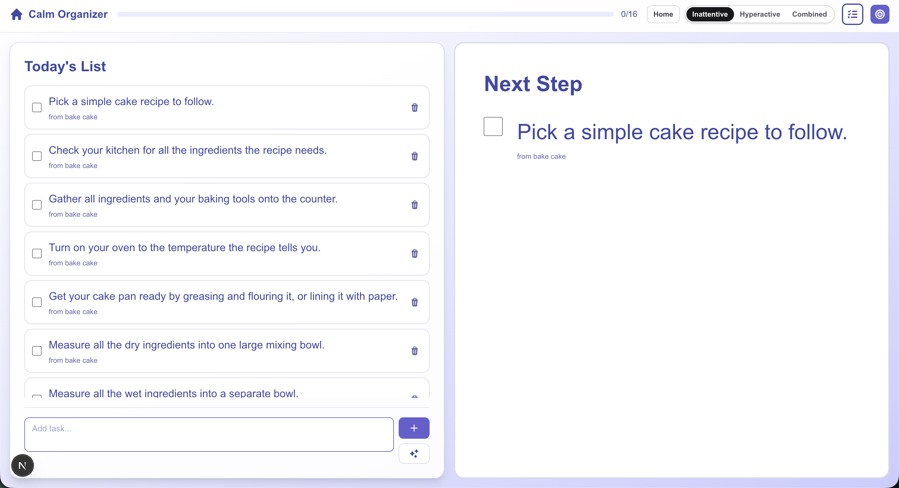
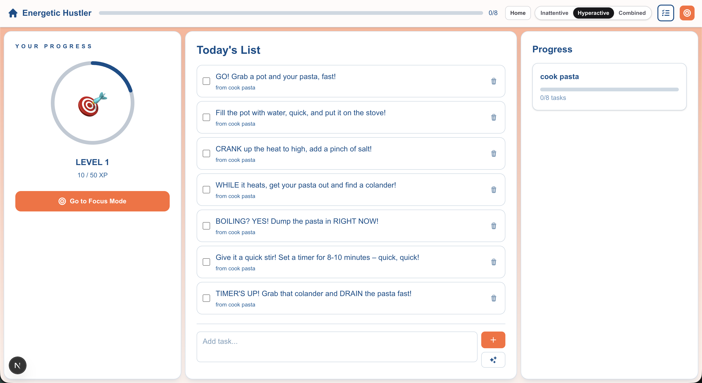
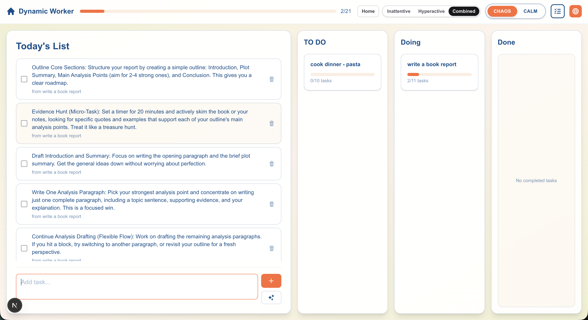
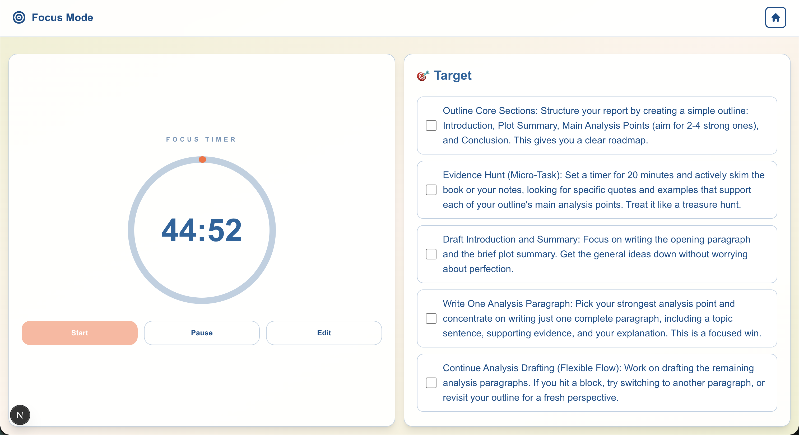

# ADHD Task Manager

A task manager with **three UI personalities**, each tuned to a different ADHD presentation: calm and focused, high-energy and gamified, or a mix of both.

Take a short quiz to get a type, or skip the quiz and hop between the three experiences.

App link : [ADHD-App](https://adhd-task-manager-seven.vercel.app/)

## How to try it

1. **Find what ADHD type you are** : a short assessment classifies you as inattentive, hyperactive-impulsive, or combined, then opens the matching UI.
2. **Experiment** : pick a type yourself and switch between them from the nav.

## Screenshots

### Inattentive


### Hyperactive


### Combined


### Focus mode


## Types

| Type | Persona | What you get |
| --- | --- | --- |
| Inattentive | Calm Organizer | One next step at a time, low visual noise |
| Hyperactive-impulsive | Energetic Hustler | XP, levels, and a higher-energy layout |
| Combined | Dynamic Worker | Chaos/Calm toggle — kanban or a single focus |

Each type keeps its own task lists in the browser. Switch anytime from the type switcher in the nav.

## Run locally

```bash
cd frontend
npm install
npm run dev
```

Create a `frontend/.env.local` file with:

```
GOOGLE_API_KEY=your_api_key_here
```

The quiz uses Gemini to classify responses. Experiment mode does not need an API key.

## Deploy

Configured for [Vercel](./VERCEL_DEPLOYMENT.md). Set the **Root Directory** to `frontend` and add `GOOGLE_API_KEY` in project settings.
